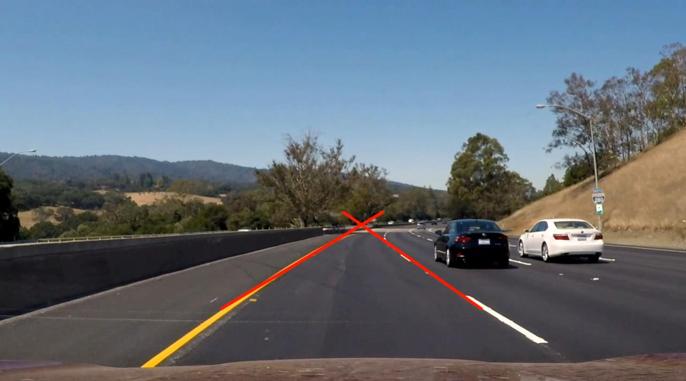

# CUDA-Accelerated Lane Detection Pipeline

A high-performance, fully CUDA-accelerated lane detection system written in C++. This project processes video streams by keeping the entire image processing pipeline (grayscale conversion, edge detection, masking, and Hough transform) on the GPU. It utilizes advanced CUDA techniques like double buffering, pinned memory, texture memory, and kernel fusion to achieve maximum throughput.

## Result



*(The output video is rendered as a binary black background with detected lanes highlighted in red.)*

## Features & Optimizations

- **Custom CUDA Kernels**: Hand-written kernels for RGB to Grayscale conversion, Sobel edge detection, and ROI masking.
- **Double Buffering (Ping-Ponging)**: Overlaps CPU video I/O with GPU execution using dual CUDA streams to prevent pipeline stalls.
- **Pinned Host Memory**: Uses `cudaMallocHost` for asynchronous, high-speed data transfers between CPU and GPU.
- **Texture Memory**: Utilizes GPU texture objects for spatial cache locality during convolution operations.
- **Kernel Fusion**: Fuses blur, Sobel filtering, thresholding, and ROI masking into a single kernel to minimize global memory round-trips.
- **Constant Memory**: Precomputes and stores Hough transform trigonometric tables in `__constant__` memory for lightning-fast read broadcasts.
- **Mathematical Optimizations**: Replaces expensive `sqrtf` operations with squared magnitude comparisons.

## Prerequisites

To build and run this project, you must have the following installed on a Linux machine:

1. **NVIDIA GPU** (Compute Capability 6.0+ recommended)
2. **NVIDIA Driver & CUDA Toolkit** (11.x or 12.x)
3. **OpenCV with CUDA support** (Must be compiled from source with `-D WITH_CUDA=ON`)
4. **CMake** (>= 3.10)
5. **C++ Compiler** (GCC/G++ supporting C++17)

## Project Structure

```text
.
├── main.cu              # The main CUDA C++ source code
├── CMakeLists.txt       # CMake build configuration
├── results/
│   └── result.png       # Sample output image
└── README.md
```

## Build & Run Instructions

1. **Clone or download** the repository to a local directory.
2. **Place your video** in the root directory and name it `input.mp4`.
3. **Create the build directory and compile:**
   ```bash
   mkdir build
   cd build
   cmake ..
   make -j$(nproc)
   ```
4. **Run the executable:**
   ```bash
   ./lane_detection
   ```
5. **View the output:** 
   The processed video will be saved as `output.mp4` in the same directory. The terminal will print the progress every 30 frames.

## How It Works

1. **Upload**: A frame is read via OpenCV, copied to pinned memory, and transferred asynchronously to the GPU.
2. **Grayscale**: The `rgb2gray_vec4` kernel processes 4 pixels per thread using vectorized memory access.
3. **Edge & Mask**: The `blur_sobel_mask_tex` kernel reads from texture memory, applies a 3x3 Sobel filter, calculates the squared gradient magnitude, and applies a trapezoidal Region of Interest (ROI) mask.
4. **Hough Transform**: The `hough_transform` kernel casts votes for edge pixels into an accumulator array using `atomicAdd`.
5. **Extraction**: The accumulator is copied back to the CPU. The CPU finds the highest-voted lines for the left and right halves of the image.
6. **Render**: A blank black image is created, and the detected lanes are drawn in red using OpenCV, then written to the output video file.